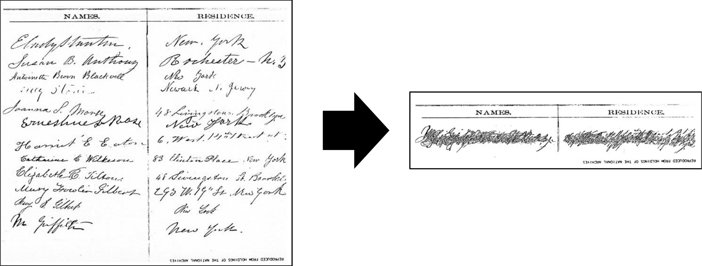

Apple, FBI, and Software Transparency
================

The [Apple versus FBI showdown](http://www.nytimes.com/2016/02/18/technology/apple-timothy-cook-fbi-san-bernardino.html)
has quickly become
a crucial flashpoint of the
&ldquo;[new Crypto War.](http://www.dailydot.com/politics/tim-cook-encryption-iphone-hero-businessman/)&rdquo;
The FBI invoked
[the All Writs Act of 1789](https://www.washingtonpost.com/news/volokh-conspiracy/wp/2016/02/19/preliminary-thoughts-on-the-apple-iphone-order-in-the-san-bernardino-case-part-2-the-all-writs-act/),
a catch-all authority for assistance of law enforcement,
demanding that Apple create a custom version of its iOS
to help the FBI decrypt an iPhone used by one of the
[San Bernardino shooters](http://www.newyorker.com/magazine/2016/02/22/preparing-for-apocalypse-in-san-bernardino).
While Apple probably [could comply](http://blog.trailofbits.com/2016/02/17/apple-can-comply-with-the-fbi-court-order/),
it is
[fighting the order](https://cryptome.org/2016/02/usg-apple-016.pdf)
on the grounds that 
&ldquo;the government demands that Apple create a back door
to defeat the encryption on the iPhone,
making its users’ most confidential and personal information vulnerable
to hackers, identity thieves, hostile foreign agents,
and unwarranted government surveillance.
&rdquo;

Indeed,
demanding that a private company
[create a new forensic instrument](http://www.zdziarski.com/blog/?p=5645)
to the government's order,
weakening the security of Apple's own devices and
[exposing their users' innermost secrets](http://www.slate.com/articles/technology/technology/2016/02/apple_and_the_fbi_think_iphones_are_safes_a_philosopher_explains_what_they.single.html),
may
[violate the first amendment](http://motherboard.vice.com/read/fbis-case-against-apple-could-violate-free-speech) &ndash;
and at any rate is
&ldquo;[like asking General Motors to build a new truck
with a fifth wheel by next month.](https://www.eff.org/deeplinks/2016/02/technical-perspective-apple-iphone-case)&rdquo;
While the FBI could probably create their own a backdoored version of iOS,
Apple's devices accept only software updates digitally signed with a secret key
that presumably only Apple controls.
*Presumably*.  Let's come back to that.

Why All the Publicity?
----------------------

One of the most interesting and unusual features of this particular case
is how quickly we, the public,
[learned about it from Apple](http://www.apple.com/customer-letter/).
The FBI could have quietly delivered this order under seal,
as it has done with
[similar decryption-assistance demands to Apple](http://www.wsj.com/articles/justice-department-seeks-to-force-apple-to-extract-data-from-about-12-other-iphones-1456202213) &ndash;
as well as to other companies
[such as Lavabit](http://www.newyorker.com/tech/elements/how-lavabit-melted-down[),
the [now-defunct](http://www.theguardian.com/commentisfree/2014/may/20/why-did-lavabit-shut-down-snowden-email) E-mail provider that Edward Snowden used.

Apple even [reportedly requested that the FBI's order be sealed](http://www.nytimes.com/2016/02/19/technology/how-tim-cook-became-a-bulwark-for-digital-privacy.html?smprod=nytcore-iphone&smid=nytcore-iphone-share),
but the FBI wanted the public showdown.
The facts of the case [undermine the FBI's claims](https://www.techdirt.com/articles/20160220/22412933661/no-fbi-does-not-need-info-farooks-iphone-this-is-entirely-about-precedent.shtml)
of urgently needing this iPhone's contents:
the killers were already long dead,
the mountain of metadata the FBI already had about the killers
revealed no hint of connections to other terrorists,
and the iPhone in question was an employer-provided work phone
that the killers did not bother to destroy
as they did their two personal phones.
The Occam's Razor interpretation of the facts suggest
that the FBI is far less interested in the data itself
than in [the court precedent](http://www.macworld.com/article/3034355/ios/why-the-fbis-request-to-apple-will-affect-civil-rights-for-a-generation.html)
a legal win would establish.

In short, it appears the FBI is &ldquo;[playing politics](https://medium.com/@thegrugq/feeble-noise-pollution-627acb5931a2#.nv513bwae)&rdquo;
via a
&ldquo;[carefully planned legal battle&hellip;months in the making.](http://www.theguardian.com/technology/2016/feb/17/inside-the-fbis-encryption-battle-with-apple?CMP=twt_gu)&rdquo;
The iPhone in question represents a strategically-chosen battleground
on which the FBI thinks it can
[win using the terrorism card](https://bgr.com/2016/02/17/fbi-vs-apple-smartphone-encryption/) &ndash;
even if this particular iPhone in fact has
[little or no intelligence value](https://theintercept.com/2016/02/26/farooks-iphone-is-probably-useless-even-the-police-say-so/).

Lining up in Apple's defense are
[a majority of the American public](http://www.reuters.com/article/us-apple-encryption-poll-idUSKCN0VX159);
public-interest organizations such as
[ALCU](https://www.aclu.org/blog/speak-freely/why-were-defending-apple), 
[EFF](https://www.eff.org/deeplinks/2016/03/deep-dive-why-forcing-apple-write-and-sign-code-violates-first-amendment),
and 
[CDT](https://cdt.org/blog/cdt-files-brief-in-support-of-apple-and-strong-encryption/);
many
[technology giants](http://www.apple.com/pr/library/2016/03/03Amicus-Briefs-in-Support-of-Apple.html)
including Google, Intel, Microsoft, Cisco, and Amazon;
newspapers such as the
[New York Times](http://www.nytimes.com/2016/02/19/opinion/why-apple-is-right-to-challenge-an-order-to-help-the-fbi.html)
and the
[Wall Street Journal](http://www.wsj.com/article_email/apple-is-right-on-encryption-1456877827-lMyQjAxMTE2NzAzMjQwNzI3Wj),
the
[UN High Commissioner for Human Rights](http://www.ohchr.org/EN/NewsEvents/Pages/DisplayNews.aspx?NewsID=17138&LangID=E);
and even the
[former director of the NSA](http://money.cnn.com/2016/01/13/technology/nsa-michael-hayden-encryption/index.html).

The Secrecy Alternative, Past and Future
----------------------------------------

Important as this public battle is,
the FBI and governments around the world
can and often have pursued the same goals in secret:
Apple versus FBI is more the exception than the rule.
Recall the result of
[the first Crypto Wars](https://www.newamerica.org/oti/doomed-to-repeat-history-lessons-from-the-crypto-wars-of-the-1990s/),
in which the US government attempted to mandate
key escrow encryption embodied in the infamous
[Clipper Chip](http://arstechnica.com/information-technology/2015/12/what-the-government-shouldve-learned-about-backdoors-from-the-clipper-chip/).
While the government lost that public battle,
they did not give up but merely
[moved their efforts to compromise encryption back into the shadows](http://www.nytimes.com/2013/09/06/us/nsa-foils-much-internet-encryption.html?_r=0).

For example, the NSA apparently
[slipped a backdoor a NIST standard for random number generation](https://www.lawfareblog.com/nsas-subversion-nists-algorithm),
allowing the holder of a secret
to compromise all cryptographic algorithms on a device.
Demonstrating the perils of keeping a backdoor
only accessible to &ldquo;the good guys,&rdquo;
an unknown attacker recently managed to &ldquo;re-key&rdquo;
and take over a latent copy of this backdoored random number generator
[in Juniper Networks routers](http://www.wired.com/2015/12/researchers-solve-the-juniper-mystery-and-they-say-its-partially-the-nsas-fault/).

Even if sanity prevails in this new round of the Crypto Wars,
we can count on continued attempts by the US and governments around the world
to aquire secret backdoors.
Governments can of course
exploit [software bugs](http://motherboard.vice.com/read/apple-fbi-should-ask-the-nsa-to-hack-shooters-iphone)
or [physical vulnerabilities](http://www.bloomberg.com/news/articles/2016-03-04/who-needs-apple-when-the-fbi-could-hack-terrorist-iphone-itself)
to break into personal devices.
Secret backdoors will continue to be most attractive, however:
it is easier, cheaper, and less risky to exploit a known backdoor
than to &ldquo;[reach into the treasure chest and engineer a custom exploit.](https://freedom-to-tinker.com/blog/dwallach/apple-the-fbi-and-the-san-bernadino-iphone/)&rdquo;

The Software Update Backdoor
----------------------------

Nearly all of today's personal devices, including Apple's,
already have a ready-made &ldquo;backdoor&rdquo; ripe for exploitation,
in the form of
[automatic software updates validated by digital signatures](http://arstechnica.com/security/2016/02/most-software-already-has-a-golden-key-backdoor-its-called-auto-update/).
One way the US government could
aquire a universal backdoor to Apple's devices is
simply by demanding a copy of Apple's secret software signing keys.
The government already showed a willingness to do exactly this,
in demanding the
[master keys to Lavabit's encrypted E-mail service](http://www.newyorker.com/tech/elements/how-lavabit-melted-down)
while investigating Snowden.
This might not be entirely trivial if Apple's software signing keys
are [held in hardware security modules](https://www.thawte.com/code-signing/whitepaper/best-practices-for-code-signing-certificates.pdf)
designed to thwart the extraction or cloning of secret keys.
In that case, however, the government could still simply
demand that Apple use its secret key to produce a valid digital signature
for the FBI's backdoored version of iOS,
while keeping this process
and the existence of this backdoored iOS secret.

Even if Apple wins this public battle, therefore,
they will still rightfully face post-Snowden fears and suspicions -
from companies and governments around the world -
as to whether Apple can still be secretly coerced into
helping to sign backdoored software and firmware images.
This risk is by no means specific to Apple,
but faced by any organization that creates and releases software.
Even open source software is not immune,
because you cannot be certain whether a software update
represents a correctly-compiled or backdoored version of a source release
[unless you build it yourself](https://wiki.debian.org/ReproducibleBuilds),
which precious few users do.

Software Transparency via Decentralized Witness Cosigning
---------------------------------------------------------

In [IEEE Security & Privacy 2016](http://www.ieee-security.org/TC/SP2016/)
we will present a paper
([preliminary draft available here](http://dedis.cs.yale.edu/dissent/papers/witness-abs))
introducing *decentralized witness cosigning*,
a technological mechanism by software makers such as Apple
could protect their users
from secretly backdoored versions of their software &ndash;
and in turn protect *themselves* and their finanical bottom lines from
worldwide fears and suspicions about the possibility of backdoored software.

With conventional digital signatures,
as currently used for most software and firmware signing processes,
a single party (e.g., Apple) holds the secret key
needed to produce valid software images
that devices and their software update mechanisms will accept.
Any well-designed update mechanism refuses to accept any software image
unless it has been authenticated using a *digital certificate*
embedded in the device,
which cryptographically identifies the software maker
via a mathematical relationship with the secret signing key.
[Best practices for software signing](https://www.thawte.com/code-signing/whitepaper/best-practices-for-code-signing-certificates.pdf)
are already
to keep particularly sensitive signing keys offline,
perhaps in HSMs or even split across multiple HSMs,
[as ICANN does](http://www.theguardian.com/technology/2014/feb/28/seven-people-keys-worldwide-internet-security-web)
in its ornate
[DNSSEC key signing ceremony](https://www.cloudflare.com/dnssec/root-signing-ceremony/).
But as noted above,
such measures do not prevent the *organization* from being coerced
into secret misuses of these signing keys.

With decentralized witness cosigning,
a software maker imprints their devices and software update mechanisms
with a digital certificate corresponding not just to their own secret key
but also to secret keys held by a group of independent *witnesses*.
These witnesses might include other cooperating software companies,
public-interest organizations such as ALCU, EFF, or CDT,
or major corporate customers or governments around the world
desiring not just verbal but also technological assurances
of the software maker's commitment to transparency.
In turn, before accepting any software image
the device's update mechanism verifies that it has been signed
not only by the software maker but also by a threshold number
of the designated witnesses.
In essence, the device does not accept any software image
unless it arrives with a cryptographic &ldquo;proof&rdquo;
that this *particular* software image has been publicly observed by &ndash;
and placed under the scrutiny of &ndash;
a decentralized group of independent parties scattered around the world
in different jurisdictions.

The Scalability of Witness Cosigning
------------------------------------

Technically, it is quite easy to implement witness cosigning
if the group of witnesses is small.
A software maker could simply gather a list of individual signatures
for each new software release,
in much the same way people have handled
[public petitions](http://ecssba.rutgers.edu/docs/petuniv.html)
for hundreds of years.
If we want the group of witnesses to be large, however &ndash;
and we *do*, to ensure that compromising transparency would
require not just a few but hundreds or even thousands of witnesses
to be colluding maliciously &ndash;
then gathering hundreds or thousands of individual signatures
for each software release could become painful and inefficient.
Worse, every device needing to validate a purported update
would need to check all these signatures individually,
causing delays and consuming battery power.

The key technical contribution of our research is a distributed protocol
that makes large, decentralized witness cosigning groups practical.
I will spare you the details for now, but those interested can
[find them here](http://dedis.cs.yale.edu/dissent/papers/witness-abs).
The oversimplified summary is that the protocol involves compressing
hundreds or thousands of signatures into a single one
that can be verified almost as simply and efficiently
verifying a normal individual signature.
For illustration,
a traditional many-signature performed this way might look as follows:

> 

Superposing standard pencil-and-paper signatures this way
would of course offer little or no security,
but such superposition *can* be made secure with modern digital signatures.
This is one of the remarkable properties of modern cryptography,
and is a well-understood property that
[long predates our work](https://www.cs.bu.edu/~reyzin/multisig.html).
Again, our contribution is to make witness cosigning groups scale.

How Does Anyone Know If There's a Backdoor?
-------------------------------------------

Unfortunately,
independent witnesses cannot necessarily determine immediately,
during the witness cosigning process,
whether or not a particular software image actually contains a backdoor.
This is especially true in the common case where the source code is proprietary
and the software maker signs and releases only binary images.
Nevertheless, the witnesses can still proactively ensure *transparency*
by ensuring proactively that
*every correctly-signed software image in existence*
has been disclosed, cataloged, and subjected to public scrutiny.

For example, if future Apple devices adopted decentralized witness cosigning,
and a government attempted to coerce Apple secretly into signing
a backdoored version of iOS version 11.2.1,
then the only way Apple could do so would be to submit
the backdoored iOS version to the independent witnesses for cosigning.
Even though those witnesses could not necessarily recognize the backdoor,
they could immediately notice that two different iOS images
labeled "version 11.2.1" have been signed:
the standard one and the backdoored one.
This inconsistency alone should
immediately raise alarms and drawing the attention of security companies
around the world, who could then perform a careful inspection
of the differences between the two software images.

A government could of course coerce Apple to give the backdoored image
a different version number that most customers never receive:
e.g., "11.2.1LE" or "11.2.1.1".
However, the witnesses would still be able to tell that an iOS image *exists*
that has been signed but not widely distributed,
again likely drawing suspicion and careful public scrutiny.

Of course, Apple &ndash; or a malicious Apple employee &ndash;
could still slip a subtle backdoor (or security &ldquo;bug&rdquo;)
into the standard iOS releases that everyone runs.
Accidental bugs and backdoors alike can persist for years without being noticed,
as [the Juniper incident](http://www.wired.com/2015/12/researchers-solve-the-juniper-mystery-and-they-say-its-partially-the-nsas-fault/)
amply demonstrates.
Open source software naturally offers a transparency advantage,
especially with
[reproducible builds](https://wiki.debian.org/ReproducibleBuilds) &ndash;
but even source-level backdoors can be
[devilishly tricky](http://www.underhanded-c.org/).

Nevertheless,
techniques and tools for analysing both source and binary software
is constantly improving,
and decentralized witness cosigning can ensure that
*all* releases of a software distribution are publicly known
and exposed to analysis by talented security researchers and white-hat hackers
around the world.
An attacker who slips a backdoor into a public software release
inherently faces a risk that the backdoor could be discovered at any time.
Witness cosigning prevents attackers from sidestepping that risk of discovery,
even by secretly deploying the backdoored software only on targeted devices
under attacker-controlled conditions.

Proactive versus Retroactive Transparency Approaches
----------------------------------------------------

Decentralized witness cosigning is by no means the first
cryptographic transparency mechanism.
For example, the Public Key Infrastructure (PKI)
used to secure Web connections
[has similar weaknesses](http://resources.infosecinstitute.com/cybercrime-exploits-digital-certificates/).
PKI transparency mechanisms such as
[Convergence](http://convergence.io),
[Sovereign Keys](https://www.eff.org/sovereign-keys),
[Certificate Transparency](https://www.certificate-transparency.org),
[AKI](https://www.cs.cmu.edu/~xia/resources/Documents/kim-www13.pdf), and
[ARPKI](https://www.cs.cmu.edu/~xia/resources/Documents/basin_ccs14.pdf)
chip away at this problem.
Certificate Transparency is now
[standard in the Chrome browser](https://www.certificate-transparency.org/certificate-transparency-in-chrome).
Related mechanisms such as 
[Perspectives](https://www.cs.cmu.edu/~perspectives/perspectives_usenix08.pdf)
and
[CONIKS](http://www.coniks.org)
address closely-related problems for Secure Shell (SSH) connections
and end-to-end encrypted messaging, respectively.

Prior transparency mechanisms have two crucial weaknesses, however:
they do not significantly increase the number of secret keys
an attacker must control to compromise any client device,
and client devices cannot even retroactively detect such compromise
unless they can actively communicate with multiple well-known Internet servers.
For example, even with Certificate Transparency,
an attacker can forge an
[Extended Validation (EV) certificate for Chrome](https://www.certificate-transparency.org/ev-ct-plan)
after compromising or coercing only three parties:
one Certificate Authority (CA) and
two [log servers](https://www.certificate-transparency.org/known-logs).
Since many CAs and log servers are in US jurisdiction,
such an attack is clearly within reach of the US government.
If such an attack does occur,
Certificate Transparency cannot detect it unless
the victim device has a chance to communicate or *gossip*
the fake certificate
with other parties on the Internet &ndash;
*after* it has already accepted and started
using the fake digital certificate.

Retroactive Mechanisms are Insufficient for Software Transparency
-----------------------------------------------------------------

These weaknesses are especially severe
in the domain of software transparency,
the issue in the Apple versus FBI case.
First, if a personal device accepts and starts running
a backdoored software update
before the device has had a chance to gossip
information about the update with other parties on the Internet,
then the backdoored software can be designed to evade transparency
simply by disabling the retroactive transparency mechanism in the code.
Second, even if the attacker for some reason
cannot or simply neglects to take this step,
the attacker can still evade transparency by controlling
either the device or its Internet access paths.
In the FBI versus Apple case, for example,
the FBI could trivially evade a retroactive transparency mechanism
and keep a backdoored iOS image secret
simply by keeping the device disconnected from the rest of the Internet
when installing their backdoored software update.

This weakness of retroactive transparency approaches
also applies to attackers who may not control the device itself
but only the device's Internet access path.
For example, a compromised Internet service provider (ISP)
or corporate Internet gateway can defeat retroactive transparency mechanisms
by persistently blocking a victim device's access
to transparency servers elsewhere on the Internet.
Even if the user's device is mobile,
a state intelligence service such as China's
&ldquo;[Great Firewall](http://edition.cnn.com/2015/10/25/asia/china-war-internet-great-firewall/)&rdquo;
could defeat retroactive transparency mechanisms by persistently blocking
connections from a targeted victim's devices to external transparency servers,
in the same way that China already blocks connections to many websites
and [to the Tor anonymity network](https://blog.torproject.org/category/tags/china).

Conclusion
----------

In short, retroactive transparency methods unfortunately
cannot actually guarantee transparency
if an attacker is in control of the target device or its Internet access path,
as in the current FBI versus Apple scenario.
Even if Apple's software updates were protected with an
analog of Certificate Transparency,
the FBI could still *secretly* force Apple or any software maker
to sign a backdoored software update,
coerce two US-based log cervers to sign fake log entries,
and keep the targeted device offline
so that it cannot gossip the fake software update metadata with anyone.

Decentralized witness cosigning is currently the only known method
of guaranteeing transparency and public accountability even in this scenario.
Witness cosigning solves this problem by offering *proactive transparency*,
enabling devices to verify a standalone cryptographic proof
that the purported software update has been seen by many independent parties,
*before* the device accepts or runs the software update.
In this way,
companies such as Apple could offer a strong guarantee to their customers
that every software images they ever sign is publicly disclosed
before any of their devices, anywhere, will consider it valid &ndash;
even if the device and/or its network connectivity
is under the control of an attacker who does *not*
exhibit the FBI's momentary taste for publicity.
 
The public debate over backdoors in personal devices
is of critical importance to our security, privacy, and personal freedom.
But equally important is ensuring that this time
the debate *stays* public.

